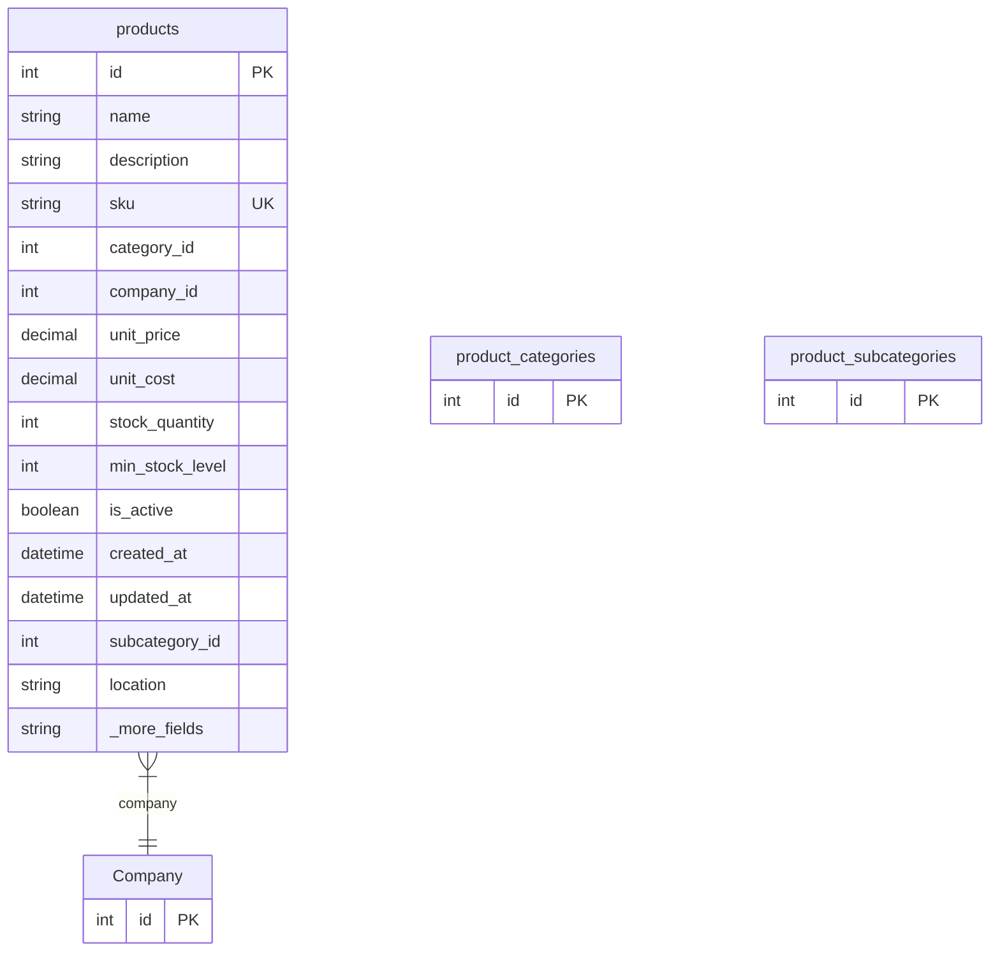

# products

**Schema location:** Lines 3482-3511

## Fields

| Field | Type | Required | Unique | Default | Notes |
|-------|------|----------|--------|---------|-------|
| `id` | `Int` | ✅ | 🔑 PK | `autoincrement(` |  |
| `name` | `String` | ✅ |  | `` | DB: VarChar(255) |
| `description` | `String?` | ❌ |  | `` |  |
| `sku` | `String?` | ❌ | ✅ | `` | DB: VarChar(100) |
| `category_id` | `Int` | ✅ |  | `` |  |
| `company_id` | `Int` | ✅ |  | `` |  |
| `unit_price` | `Decimal?` | ❌ |  | `0` | DB: Decimal(15, 2) |
| `unit_cost` | `Decimal?` | ❌ |  | `0` | DB: Decimal(15, 2) |
| `stock_quantity` | `Int?` | ❌ |  | `0` |  |
| `min_stock_level` | `Int?` | ❌ |  | `0` |  |
| `is_active` | `Boolean?` | ❌ |  | `true` |  |
| `created_at` | `DateTime?` | ❌ |  | `now(` | DB: Timestamp(6) |
| `updated_at` | `DateTime?` | ❌ |  | `now(` | DB: Timestamp(6) |
| `subcategory_id` | `Int?` | ❌ |  | `` |  |
| `location` | `String?` | ❌ |  | `` | DB: VarChar(255) |
| `weight` | `Decimal?` | ❌ |  | `0` | DB: Decimal(15, 3) |
| `volume` | `Decimal?` | ❌ |  | `0` | DB: Decimal(15, 3) |
| `volume_unit` | `String?` | ❌ |  | `"metros_lineales"` | DB: VarChar(50) |
| `image` | `String?` | ❌ |  | `` | DB: VarChar(500) |
| `images` | `Json?` | ❌ |  | `` |  |
| `product_categories` | `product_categories` | ✅ |  | `` |  |
| `product_subcategories` | `product_subcategories?` | ❌ |  | `` |  |

## Relations

| Field | Type | Cardinality | FK Fields | References | On Delete |
|-------|------|-------------|-----------|------------|-----------|
| `company` | [Company](./models/Company.md) | Many-to-One | company_id | id | Cascade |

## Referenced By

| Model | Field | Cardinality |
|-------|-------|-------------|
| [Company](./models/Company.md) | `products_lowercase` | Has many |
| [product_categories](./models/product_categories.md) | `products` | Has many |
| [product_subcategories](./models/product_subcategories.md) | `products` | Has many |

## Indexes

- `category_id`
- `subcategory_id`
- `company_id`
- `sku`

## Entity Diagram

