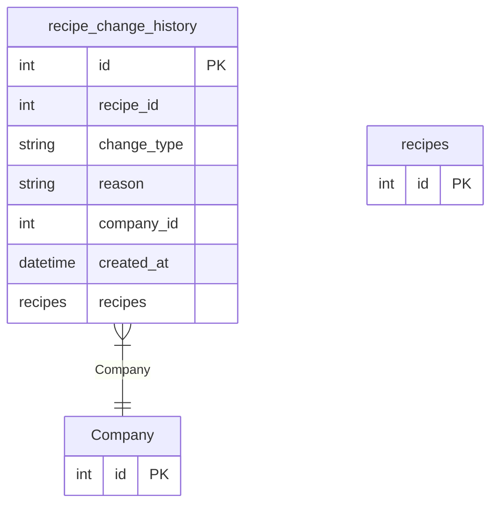

# recipe_change_history

**Schema location:** Lines 3845-3856

## Fields

| Field | Type | Required | Unique | Default | Notes |
|-------|------|----------|--------|---------|-------|
| `id` | `Int` | ✅ | 🔑 PK | `autoincrement(` |  |
| `recipe_id` | `Int` | ✅ |  | `` |  |
| `change_type` | `String` | ✅ |  | `` | DB: VarChar(50) |
| `reason` | `String?` | ❌ |  | `` |  |
| `company_id` | `Int` | ✅ |  | `` |  |
| `created_at` | `DateTime?` | ❌ |  | `now(` | DB: Timestamp(6) |
| `recipes` | `recipes` | ✅ |  | `` |  |

## Relations

| Field | Type | Cardinality | FK Fields | References | On Delete |
|-------|------|-------------|-----------|------------|-----------|
| `Company` | [Company](./models/Company.md) | Many-to-One | company_id | id | Cascade |

## Referenced By

| Model | Field | Cardinality |
|-------|-------|-------------|
| [Company](./models/Company.md) | `recipe_change_history` | Has many |
| [recipes](./models/recipes.md) | `recipe_change_history` | Has many |

## Indexes

- `recipe_id`

## Entity Diagram

