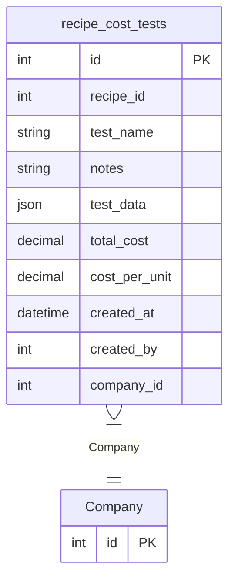

# recipe_cost_tests

**Schema location:** Lines 3827-3843

## Fields

| Field | Type | Required | Unique | Default | Notes |
|-------|------|----------|--------|---------|-------|
| `id` | `Int` | ✅ | 🔑 PK | `autoincrement(` |  |
| `recipe_id` | `Int` | ✅ |  | `` |  |
| `test_name` | `String` | ✅ |  | `` | DB: VarChar(255) |
| `notes` | `String?` | ❌ |  | `` |  |
| `test_data` | `Json` | ✅ |  | `` |  |
| `total_cost` | `Decimal` | ✅ |  | `` | DB: Decimal(10, 2) |
| `cost_per_unit` | `Decimal` | ✅ |  | `` | DB: Decimal(10, 2) |
| `created_at` | `DateTime?` | ❌ |  | `now(` | DB: Timestamp(6) |
| `created_by` | `Int?` | ❌ |  | `` |  |
| `company_id` | `Int` | ✅ |  | `` |  |

## Relations

| Field | Type | Cardinality | FK Fields | References | On Delete |
|-------|------|-------------|-----------|------------|-----------|
| `Company` | [Company](./models/Company.md) | Many-to-One | company_id | id | Cascade |

## Referenced By

| Model | Field | Cardinality |
|-------|-------|-------------|
| [Company](./models/Company.md) | `recipe_cost_tests` | Has many |

## Indexes

- `recipe_id`
- `company_id`
- `created_at`

## Entity Diagram

