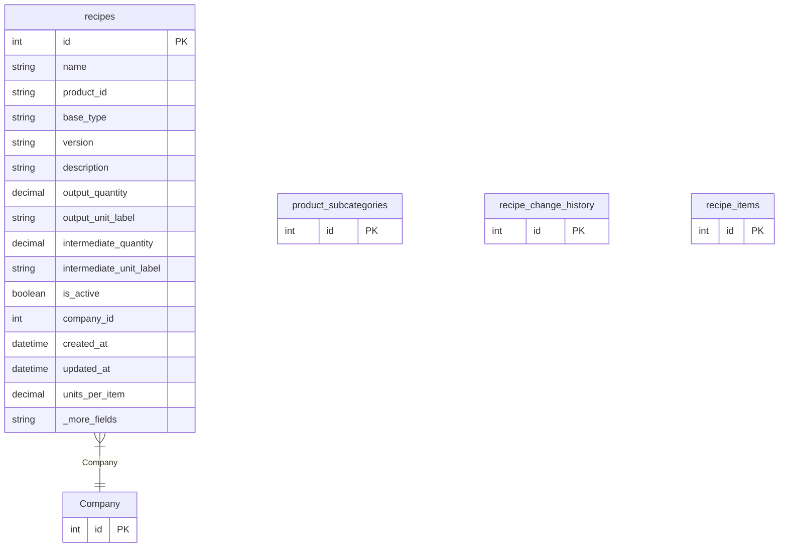

# recipes

**Schema location:** Lines 3797-3825

## Fields

| Field | Type | Required | Unique | Default | Notes |
|-------|------|----------|--------|---------|-------|
| `id` | `Int` | ✅ | 🔑 PK | `autoincrement(` |  |
| `name` | `String` | ✅ |  | `` | DB: VarChar(255) |
| `product_id` | `String?` | ❌ |  | `` |  |
| `base_type` | `String` | ✅ |  | `` | DB: VarChar(20) |
| `version` | `String` | ✅ |  | `` | DB: VarChar(50) |
| `description` | `String?` | ❌ |  | `` |  |
| `output_quantity` | `Decimal?` | ❌ |  | `` | DB: Decimal(10, 5) |
| `output_unit_label` | `String?` | ❌ |  | `"unidades"` | DB: VarChar(100) |
| `intermediate_quantity` | `Decimal?` | ❌ |  | `` | DB: Decimal(10, 5) |
| `intermediate_unit_label` | `String?` | ❌ |  | `"placas"` | DB: VarChar(100) |
| `is_active` | `Boolean?` | ❌ |  | `true` |  |
| `company_id` | `Int` | ✅ |  | `` |  |
| `created_at` | `DateTime?` | ❌ |  | `now(` | DB: Timestamp(6) |
| `updated_at` | `DateTime?` | ❌ |  | `now(` | DB: Timestamp(6) |
| `units_per_item` | `Decimal?` | ❌ |  | `` | DB: Decimal(10, 4) |
| `subcategory_id` | `Int?` | ❌ |  | `` |  |
| `metros_utiles` | `Decimal?` | ❌ |  | `` | DB: Decimal(10, 2) |
| `cantidad_pastones` | `Int?` | ❌ |  | `` |  |
| `notes` | `String?` | ❌ |  | `` |  |
| `recipe_change_history` | `recipe_change_history[]` | ✅ |  | `` |  |
| `recipe_items` | `recipe_items[]` | ✅ |  | `` |  |
| `product_subcategories` | `product_subcategories?` | ❌ |  | `` |  |

## Relations

| Field | Type | Cardinality | FK Fields | References | On Delete |
|-------|------|-------------|-----------|------------|-----------|
| `Company` | [Company](./models/Company.md) | Many-to-One | company_id | id | Cascade |

## Referenced By

| Model | Field | Cardinality |
|-------|-------|-------------|
| [Company](./models/Company.md) | `recipes_new` | Has many |
| [product_subcategories](./models/product_subcategories.md) | `recipes` | Has many |
| [recipe_change_history](./models/recipe_change_history.md) | `recipes` | Has one |
| [recipe_items](./models/recipe_items.md) | `recipes` | Has one |

## Indexes

- `company_id`
- `product_id`

## Unique Constraints

- `product_id, name, version, company_id`

## Entity Diagram

