# suppliers

**Schema location:** Lines 3513-3581

## Fields

| Field | Type | Required | Unique | Default | Notes |
|-------|------|----------|--------|---------|-------|
| `id` | `Int` | ✅ | 🔑 PK | `autoincrement(` |  |
| `name` | `String` | ✅ |  | `` | DB: VarChar(255) |
| `contact_person` | `String?` | ❌ |  | `` | DB: VarChar(255) |
| `phone` | `String?` | ❌ |  | `` | DB: VarChar(50) |
| `email` | `String?` | ❌ |  | `` | DB: VarChar(255) |
| `address` | `String?` | ❌ |  | `` |  |
| `city` | `String?` | ❌ |  | `` | DB: VarChar(255). Campos extendidos de ubicación |
| `postal_code` | `String?` | ❌ |  | `` | DB: VarChar(50) |
| `province` | `String?` | ❌ |  | `` | DB: VarChar(255) |
| `condiciones_pago` | `String?` | ❌ |  | `` | DB: VarChar(255) |
| `prontoPagoDias` | `Int?` | ❌ |  | `` | Días para descuento (ej: 10) |
| `prontoPagoPorcentaje` | `Decimal?` | ❌ |  | `` | DB: Decimal(5, 2). % descuento (ej: 2.5) |
| `prontoPagoAplicaSobre` | `String?` | ❌ |  | `` | DB: VarChar(20). "NETO" | "TOTAL" | "NETO_SIN_IVA" |
| `ingresos_brutos` | `String?` | ❌ |  | `` | DB: VarChar(100) |
| `condicion_iva` | `String?` | ❌ |  | `` | DB: VarChar(100) |
| `cbu` | `String?` | ❌ |  | `` |  |
| `alias_cbu` | `String?` | ❌ |  | `` |  |
| `banco` | `String?` | ❌ |  | `` |  |
| `tipo_cuenta` | `String?` | ❌ |  | `` |  |
| `numero_cuenta` | `String?` | ❌ |  | `` |  |
| `contact_phone` | `String?` | ❌ |  | `` | DB: VarChar(50). Contacto y notas adicionales |
| `contact_email` | `String?` | ❌ |  | `` | DB: VarChar(255) |
| `notes` | `String?` | ❌ |  | `` |  |
| `isBlocked` | `Boolean` | ✅ |  | `false` | Bloqueo de proveedor |
| `blockedReason` | `String?` | ❌ |  | `` |  |
| `blockedAt` | `DateTime?` | ❌ |  | `` |  |
| `blockedByUserId` | `Int?` | ❌ |  | `` |  |
| `company_id` | `Int` | ✅ |  | `` |  |
| `created_at` | `DateTime?` | ❌ |  | `now(` | DB: Timestamp(6) |
| `updated_at` | `DateTime?` | ❌ |  | `now(` | DB: Timestamp(6) |
| `cuit` | `String?` | ❌ |  | `` | DB: VarChar(20) |
| `razon_social` | `String?` | ❌ |  | `` | DB: VarChar(255) |
| `codigo` | `String?` | ❌ |  | `` | DB: VarChar(50) |
| `supplies` | `supplies[]` | ✅ |  | `` |  |

## Relations

| Field | Type | Cardinality | FK Fields | References | On Delete |
|-------|------|-------------|-----------|------------|-----------|
| `purchaseReceipts` | [PurchaseReceipt](./models/PurchaseReceipt.md) | One-to-Many | - | - | - |
| `purchaseReceiptItems` | [PurchaseReceiptItem](./models/PurchaseReceiptItem.md) | One-to-Many | - | - | - |
| `supplierItems` | [SupplierItem](./models/SupplierItem.md) | One-to-Many | - | - | - |
| `paymentOrders` | [PaymentOrder](./models/PaymentOrder.md) | One-to-Many | - | - | - |
| `Company` | [Company](./models/Company.md) | Many-to-One | company_id | id | NoAction |
| `purchaseOrders` | [PurchaseOrder](./models/PurchaseOrder.md) | One-to-Many | - | - | - |
| `goodsReceipts` | [GoodsReceipt](./models/GoodsReceipt.md) | One-to-Many | - | - | - |
| `creditDebitNotes` | [CreditDebitNote](./models/CreditDebitNote.md) | One-to-Many | - | - | - |
| `paymentRequests` | [PaymentRequest](./models/PaymentRequest.md) | One-to-Many | - | - | - |
| `purchaseReturns` | [PurchaseReturn](./models/PurchaseReturn.md) | One-to-Many | - | - | - |
| `supplierLeadTimes` | [SupplierLeadTime](./models/SupplierLeadTime.md) | One-to-Many | - | - | - |
| `replenishmentSuggestions` | [ReplenishmentSuggestion](./models/ReplenishmentSuggestion.md) | One-to-Many | - | - | - |
| `accountMovements` | [SupplierAccountMovement](./models/SupplierAccountMovement.md) | One-to-Many | - | - | - |
| `purchaseQuotations` | [PurchaseQuotation](./models/PurchaseQuotation.md) | One-to-Many | - | - | - |
| `creditNoteRequests` | [CreditNoteRequest](./models/CreditNoteRequest.md) | One-to-Many | - | - | - |
| `serviceContracts` | [ServiceContract](./models/ServiceContract.md) | One-to-Many | - | - | - |
| `grniAccruals` | [GRNIAccrual](./models/GRNIAccrual.md) | One-to-Many | - | - | - |
| `changeRequests` | [SupplierChangeRequest](./models/SupplierChangeRequest.md) | One-to-Many | - | - | - |

## Referenced By

| Model | Field | Cardinality |
|-------|-------|-------------|
| [Company](./models/Company.md) | `suppliers` | Has many |
| [SupplierChangeRequest](./models/SupplierChangeRequest.md) | `supplier` | Has one |
| [supplies](./models/supplies.md) | `suppliers` | Has one |
| [SupplierAccountMovement](./models/SupplierAccountMovement.md) | `supplier` | Has one |
| [PurchaseReceipt](./models/PurchaseReceipt.md) | `proveedor` | Has one |
| [PurchaseReceiptItem](./models/PurchaseReceiptItem.md) | `proveedor` | Has one |
| [SupplierItem](./models/SupplierItem.md) | `supplier` | Has one |
| [PaymentOrder](./models/PaymentOrder.md) | `proveedor` | Has one |
| [PurchaseOrder](./models/PurchaseOrder.md) | `proveedor` | Has one |
| [GoodsReceipt](./models/GoodsReceipt.md) | `proveedor` | Has one |
| [GRNIAccrual](./models/GRNIAccrual.md) | `supplier` | Has one |
| [CreditDebitNote](./models/CreditDebitNote.md) | `proveedor` | Has one |
| [CreditNoteRequest](./models/CreditNoteRequest.md) | `proveedor` | Has one |
| [PaymentRequest](./models/PaymentRequest.md) | `proveedor` | Has one |
| [PurchaseReturn](./models/PurchaseReturn.md) | `proveedor` | Has one |
| [ReplenishmentSuggestion](./models/ReplenishmentSuggestion.md) | `proveedor` | Has one |
| [SupplierLeadTime](./models/SupplierLeadTime.md) | `supplier` | Has one |
| [PurchaseQuotation](./models/PurchaseQuotation.md) | `supplier` | Has one |
| [ServiceContract](./models/ServiceContract.md) | `proveedor` | Has one |

## Indexes

- `company_id`
- `cuit`
- `codigo`
- `isBlocked`

## Entity Diagram

```mermaid
erDiagram
    suppliers {
        int id PK
        string name
        string contact_person
        string phone
        string email
        string address
        string city
        string postal_code
        string province
        string condiciones_pago
        int prontoPagoDias
        decimal prontoPagoPorcentaje
        string prontoPagoAplicaSobre
        string ingresos_brutos
        string condicion_iva
        string _more_fields
    }
    PurchaseReceipt {
        int id PK
    }
    PurchaseReceiptItem {
        int id PK
    }
    SupplierItem {
        int id PK
    }
    PaymentOrder {
        int id PK
    }
    Company {
        int id PK
    }
    PurchaseOrder {
        int id PK
    }
    GoodsReceipt {
        int id PK
    }
    CreditDebitNote {
        int id PK
    }
    PaymentRequest {
        int id PK
    }
    PurchaseReturn {
        int id PK
    }
    SupplierLeadTime {
        int id PK
    }
    ReplenishmentSuggestion {
        int id PK
    }
    SupplierAccountMovement {
        int id PK
    }
    PurchaseQuotation {
        int id PK
    }
    CreditNoteRequest {
        int id PK
    }
    ServiceContract {
        int id PK
    }
    GRNIAccrual {
        int id PK
    }
    SupplierChangeRequest {
        int id PK
    }
    supplies {
        int id PK
    }
    suppliers ||--o{ PurchaseReceipt : "purchaseReceipts"
    suppliers ||--o{ PurchaseReceiptItem : "purchaseReceiptItems"
    suppliers ||--o{ SupplierItem : "supplierItems"
    suppliers ||--o{ PaymentOrder : "paymentOrders"
    suppliers }|--|| Company : "Company"
    suppliers ||--o{ PurchaseOrder : "purchaseOrders"
    suppliers ||--o{ GoodsReceipt : "goodsReceipts"
    suppliers ||--o{ CreditDebitNote : "creditDebitNotes"
    suppliers ||--o{ PaymentRequest : "paymentRequests"
    suppliers ||--o{ PurchaseReturn : "purchaseReturns"
    suppliers ||--o{ SupplierLeadTime : "supplierLeadTimes"
    suppliers ||--o{ ReplenishmentSuggestion : "replenishmentSuggestions"
    suppliers ||--o{ SupplierAccountMovement : "accountMovements"
    suppliers ||--o{ PurchaseQuotation : "purchaseQuotations"
    suppliers ||--o{ CreditNoteRequest : "creditNoteRequests"
    suppliers ||--o{ ServiceContract : "serviceContracts"
    suppliers ||--o{ GRNIAccrual : "grniAccruals"
    suppliers ||--o{ SupplierChangeRequest : "changeRequests"
```

