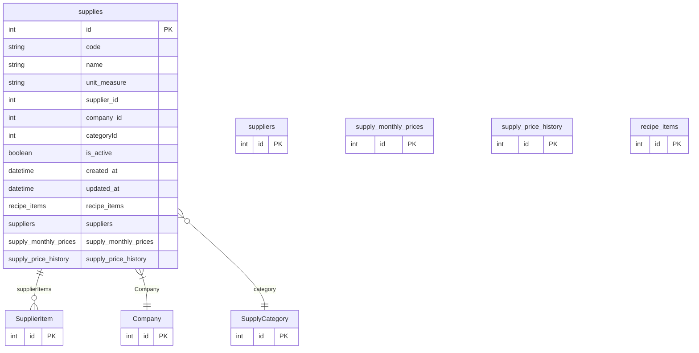

# supplies

**Schema location:** Lines 3661-3683

## Fields

| Field | Type | Required | Unique | Default | Notes |
|-------|------|----------|--------|---------|-------|
| `id` | `Int` | ✅ | 🔑 PK | `autoincrement(` |  |
| `code` | `String?` | ❌ |  | `` | DB: VarChar(50). Código interno propio |
| `name` | `String` | ✅ |  | `` | DB: VarChar(255) |
| `unit_measure` | `String` | ✅ |  | `"TN"` | DB: VarChar(50) |
| `supplier_id` | `Int?` | ❌ |  | `` |  |
| `company_id` | `Int` | ✅ |  | `` |  |
| `categoryId` | `Int?` | ❌ |  | `` | FK a SupplyCategory |
| `is_active` | `Boolean?` | ❌ |  | `true` |  |
| `created_at` | `DateTime?` | ❌ |  | `now(` | DB: Timestamp(6) |
| `updated_at` | `DateTime?` | ❌ |  | `now(` | DB: Timestamp(6) |
| `recipe_items` | `recipe_items[]` | ✅ |  | `` |  |
| `suppliers` | `suppliers?` | ❌ |  | `` |  |
| `supply_monthly_prices` | `supply_monthly_prices[]` | ✅ |  | `` |  |
| `supply_price_history` | `supply_price_history[]` | ✅ |  | `` |  |

## Relations

| Field | Type | Cardinality | FK Fields | References | On Delete |
|-------|------|-------------|-----------|------------|-----------|
| `supplierItems` | [SupplierItem](./models/SupplierItem.md) | One-to-Many | - | - | - |
| `Company` | [Company](./models/Company.md) | Many-to-One | company_id | id | NoAction |
| `category` | [SupplyCategory](./models/SupplyCategory.md) | Many-to-One (optional) | categoryId | id | SetNull |

## Referenced By

| Model | Field | Cardinality |
|-------|-------|-------------|
| [Company](./models/Company.md) | `supplies` | Has many |
| [suppliers](./models/suppliers.md) | `supplies` | Has many |
| [SupplyCategory](./models/SupplyCategory.md) | `supplies` | Has many |
| [supply_monthly_prices](./models/supply_monthly_prices.md) | `supplies` | Has one |
| [supply_price_history](./models/supply_price_history.md) | `supplies` | Has one |
| [recipe_items](./models/recipe_items.md) | `supplies` | Has one |
| [SupplierItem](./models/SupplierItem.md) | `supply` | Has one |

## Indexes

- `company_id`
- `categoryId`

## Unique Constraints

- `company_id, code`

## Entity Diagram

