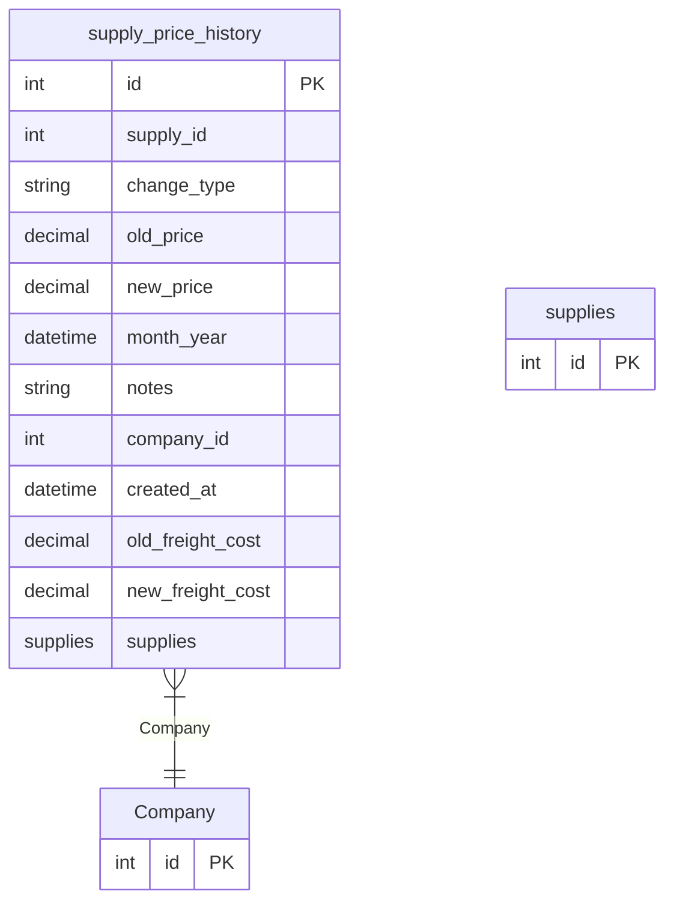

# supply_price_history

**Schema location:** Lines 3781-3795

## Fields

| Field | Type | Required | Unique | Default | Notes |
|-------|------|----------|--------|---------|-------|
| `id` | `Int` | ✅ | 🔑 PK | `autoincrement(` |  |
| `supply_id` | `Int` | ✅ |  | `` |  |
| `change_type` | `String` | ✅ |  | `` | DB: VarChar(50) |
| `old_price` | `Decimal?` | ❌ |  | `` | DB: Decimal(15, 2) |
| `new_price` | `Decimal?` | ❌ |  | `` | DB: Decimal(15, 2) |
| `month_year` | `DateTime` | ✅ |  | `` | DB: Date |
| `notes` | `String?` | ❌ |  | `` |  |
| `company_id` | `Int` | ✅ |  | `` |  |
| `created_at` | `DateTime?` | ❌ |  | `now(` | DB: Timestamp(6) |
| `old_freight_cost` | `Decimal?` | ❌ |  | `0` | DB: Decimal(15, 2) |
| `new_freight_cost` | `Decimal?` | ❌ |  | `0` | DB: Decimal(15, 2) |
| `supplies` | `supplies` | ✅ |  | `` |  |

## Relations

| Field | Type | Cardinality | FK Fields | References | On Delete |
|-------|------|-------------|-----------|------------|-----------|
| `Company` | [Company](./models/Company.md) | Many-to-One | company_id | id | NoAction |

## Referenced By

| Model | Field | Cardinality |
|-------|-------|-------------|
| [Company](./models/Company.md) | `supply_price_history` | Has many |
| [supplies](./models/supplies.md) | `supply_price_history` | Has many |

## Entity Diagram

